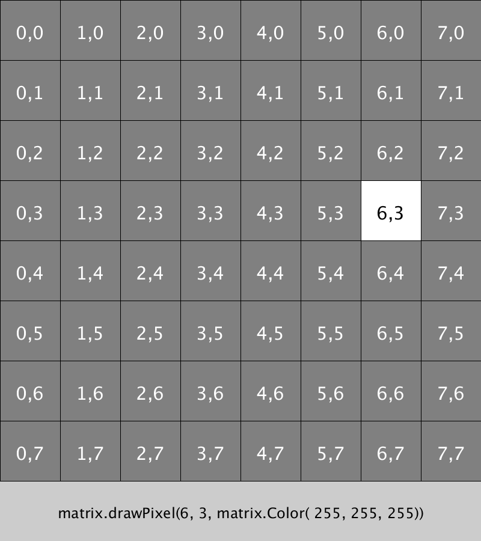

# LED-MATRIX
These files show a base use for a 8 x 8 RGB LED matrix using the adafruit GFX library and the adafruit NeoPixel library.



## Functions to control drawing

### Draw one pixel
```java
matrix.drawPixel(x, y, matrix.Color(r, g, b));
```
> x: horizontal position <br />
> y: vertical position <br />
> r: red value (0, 255) <br />
> g: green value (0,255) <br />
> b: blue value (0, 255) <br />


### Draw a line
```java
matrix.drawLine(x1, y1, x2, y2, matrix.Color(r, g, b));
```
> x1: horizontal position for start of the line <br />
> y1: vertical position for start of the line <br />
> x2: horizontal position for end of the line <br />
> y2: vertical position for end of the line <br />


### Draw a Rectangle outline
```java
matrix.drawRect(x, y, w, h, matrix.Color(r, g, b));
```
> x1: horizontal position for top left rectangle <br />
> y1: vertical position for top left rectangle <br />
> w: width of the rectangle <br />
> h: height of the rectangle <br />


### Draw a filled Rectangle
```java
matrix.fillRect(x, y, w, h, matrix.Color(r, g, b));
```

### Draw a Circle outline
```
matrix.drawCircle(x, y, rad, matrix.Color(r, g, b));
```
> x: horizontal centre of circle <br />
> y: vertical centre of circle <br />
> rad: radius of circle <br />

### Draw a filled Circle
```java
matrix.fillCircle(x, y, rad, matrix.Color(r, g, b));
```
> rad = radius of circle <br />

### Set overall brightness of display
```java
matrix.setBrightness(255);
```

### Clear whole display
```java
matrix.clear();
```

### Update the display
```java
matrix.show();
```
